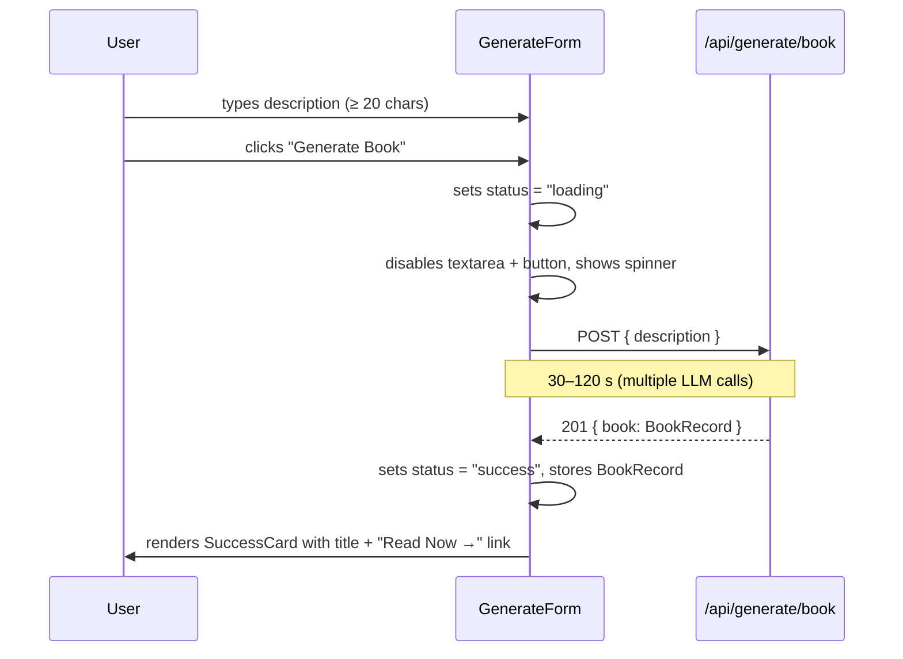
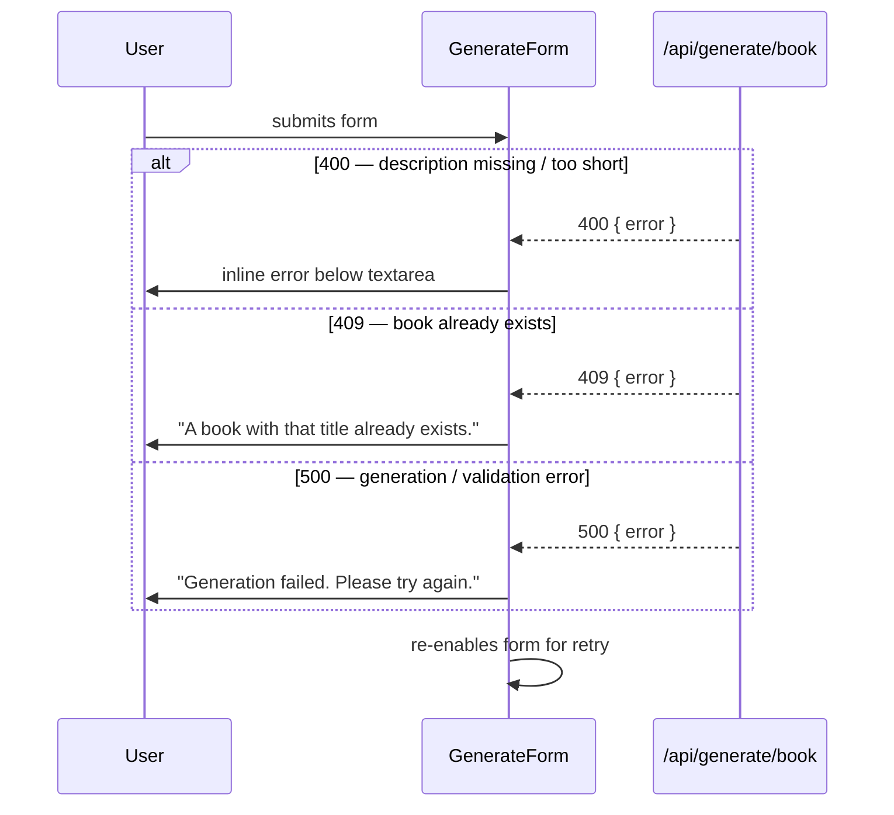

# Design Document: Book Generation UI

## Overview

Add a `/generate` page and supporting `GenerateForm` component that lets users
describe a book in plain text and trigger AI generation via the existing
`POST /api/generate/book` endpoint. The UI fits seamlessly into the existing
Next.js 14 / Tailwind CSS / dark-mode app with no new npm packages.

The page follows the existing app's visual language: indigo accent, rounded-xl
cards, light/dark surface hierarchy, and the standard `max-w-7xl` page wrapper.
Because generation takes 30–120 seconds, the UI gives clear ongoing feedback
throughout the wait and surfaces friendly, actionable errors for every failure
mode.

---

## Architecture

```mermaid
graph TD
    A[Navbar — add Generate link] --> B[/generate page\nServer Component]
    B --> C[GenerateForm\nClient Component]
    C -->|POST { description }| D[/api/generate/book\nexisting endpoint]
    D -->|201 BookRecord| C
    D -->|400 / 409 / 500| C
    C -->|on success| E[SuccessCard\ninline inside GenerateForm]
    E -->|Read Now →| F[/read/:id/1]
```

---

## Sequence Diagrams

### Happy path — successful generation



### Error paths



---

## Components and Interfaces

### `src/app/generate/page.tsx` — Server Component

**Purpose**: Page shell. Renders the page title, subtitle, and `<GenerateForm>`.
No fetching, no state.

**Responsibilities**:
- Render a page heading "Generate a Book"
- Render a short subtitle
- Render `<GenerateForm />`
- Apply the standard `max-w-7xl mx-auto px-4 sm:px-6 lg:px-8 py-10` wrapper

---

### `src/components/generate/GenerateForm.tsx` — Client Component

```typescript
"use client"

type Status = "idle" | "loading" | "success" | "error"

interface GenerateFormState {
  status: Status
  errorMessage: string | null
  book: BookRecord | null   // populated on success
}

interface BookRecord {
  id: string
  title: string
  // ...other fields returned by the API (not all needed in UI)
}
```

**Responsibilities**:
- Maintain `status`, `errorMessage`, `book` local state
- Validate description ≥ 20 characters before submitting (client-side)
- POST to `/api/generate/book`
- Show loading state (spinner + "Generating your book…") for the full duration
- On 201: transition to success state, render success card inline
- On 400/409/500: transition to error state, show inline error message
- Re-enable the form after any error so the user can retry
- Textarea is disabled while `status === "loading"`
- Submit button is disabled while `status === "loading"` or description < 20 chars

**Sub-components** (all inline in the same file or same directory):

| Element | Condition | Behaviour |
|---------|-----------|-----------|
| `<textarea>` | always | 4 rows, min-length hint in placeholder |
| Character counter | always | shows `n / 20 chars minimum` |
| Submit `<button>` | idle / error | enabled when ≥ 20 chars |
| Spinner + label | loading | replaces button label |
| Inline error | error | below textarea, red text |
| SuccessCard | success | replaces entire form area |

---

### SuccessCard (inline in `GenerateForm.tsx`)

```typescript
interface SuccessCardProps {
  book: BookRecord
}
```

**Responsibilities**:
- Display a green checkmark icon (SVG, inline)
- Show the generated book's title
- Render a "Read Now →" link to `/read/<book.id>/1`
- Offer a "Generate another" button that resets state to idle

---

### Navbar update — `src/components/ui/Navbar.tsx`

Add a "Generate" `<Link>` between the "Catalog" link and the theme toggle:

```typescript
<Link href="/generate" className="text-sm font-medium text-gray-700 dark:text-gray-300 hover:text-indigo-600 dark:hover:text-indigo-400 transition-colors">
  Generate
</Link>
```

---

## Data Models

### `GenerateBookRequest`

```typescript
interface GenerateBookRequest {
  description: string   // non-empty, >= 20 chars
}
```

**Validation rules**:
- Must be a string
- Must be trimmed length ≥ 20

### `GenerateBookResponse` (201)

```typescript
interface GenerateBookResponse {
  book: {
    id: string        // URL-safe slug
    title: string
    author: string
    // other fields present but not consumed by the UI
  }
}
```

### `ApiErrorResponse` (400 / 409 / 500)

```typescript
interface ApiErrorResponse {
  error: string
}
```

---

## Error Handling

### Scenario 1 — Client-side validation (< 20 chars)

**Condition**: User clicks submit with `description.trim().length < 20`  
**Response**: Submit is disabled; button remains inert. No API call is made.  
**Recovery**: User types more text; button enables automatically.

### Scenario 2 — 400 Bad Request

**Condition**: API returns 400  
**Response**: Display API error message inline below the textarea  
**Recovery**: Form re-enabled; user can edit and resubmit.

### Scenario 3 — 409 Conflict (book already exists)

**Condition**: API returns 409  
**Response**: Display "A book with that title already exists. Try a different description."  
**Recovery**: Form re-enabled; user can modify the description.

### Scenario 4 — 500 / network error

**Condition**: API returns 5xx or `fetch` throws  
**Response**: Display "Generation failed. Please try again."  
**Recovery**: Form re-enabled; user can retry.

### Scenario 5 — Long wait (> 60 seconds)

**Condition**: `status === "loading"` for an extended period  
**Response**: Spinner + "Generating your book… This can take a minute or two." — no timeout, no automatic abort.  
**Recovery**: User waits; result arrives when ready.

---

## Testing Strategy

### Unit Testing Approach

Test the pure validation logic and error-message mapping in isolation:
- `descriptionIsValid(text: string): boolean` — returns true iff trimmed length ≥ 20
- `mapApiError(status: number, body: ApiErrorResponse): string` — maps status codes to user-facing strings

### Property-Based Testing Approach

**Property Test Library**: `fast-check` (already in devDependencies from the `ai-book-generation` spec)

Two pure helper functions extracted from `GenerateForm.tsx` are property-tested:

| Function | Property |
|----------|----------|
| `descriptionIsValid` | For all strings with trimmed length ≥ 20 → returns true |
| `descriptionIsValid` | For all strings with trimmed length < 20 → returns false |
| `mapApiError` | For any 4xx/5xx status code, always returns a non-empty string |

### Integration Testing Approach

Not applicable — the API layer is pre-existing and tested separately.

---

## Performance Considerations

- No new dependencies; no bundle-size impact beyond the two new files.
- The `<GenerateForm>` component is client-only; the `/generate` page shell is a server component, so the initial HTML is streamed with zero JavaScript for the page chrome.
- The textarea and button are rendered as plain HTML elements — no virtual-list or heavy rendering path.

---

## Security Considerations

- The description is sent as a plain JSON string; no HTML or script injection risk on the frontend.
- No authentication is enforced in this UI layer (the existing API may require a session cookie; the form sends credentials via the default `fetch` same-origin behaviour).
- No secrets or tokens are handled in the UI.

---

## Dependencies

No new npm packages. Relies on:
- Next.js 14 App Router (`"use client"`, `Link`, `NextRequest`)
- Tailwind CSS (all styling)
- `fast-check` — already in `devDependencies` from the `ai-book-generation` spec
- Existing API endpoint `POST /api/generate/book`

---

## Correctness Properties

*A property is a characteristic or behavior that should hold true across all valid executions of a system — essentially, a formal statement about what the system should do. Properties serve as the bridge between human-readable specifications and machine-verifiable correctness guarantees.*

### Property 1: Description validation exactly matches the 20-character threshold

*For any* string `s`, `descriptionIsValid(s)` SHALL return `true` if and only if `s.trim().length >= 20`. Equivalently: `descriptionIsValid(s) === (s.trim().length >= 20)` for all possible string values, including empty strings, whitespace-only strings, strings with Unicode characters, and strings at the exact boundary.

**Validates: Requirements 1.2, 1.3**

### Property 2: Success link URL is always constructed as `/read/<id>/1`

*For any* `BookRecord` with any `id` value, the "Read Now →" link rendered by `SuccessCard` SHALL have an `href` equal to `/read/${id}/1`. The URL construction must hold for all valid `id` strings, including slugs with hyphens, numbers, and lowercase letters.

**Validates: Requirements 3.3**

### Property 3: Error mapper always returns a non-empty string

*For any* HTTP status code in the 4xx–5xx range and any `ApiErrorResponse` body (including empty bodies and network-failure cases), `mapApiError` SHALL return a non-empty string that the UI can safely render. It SHALL never return `null`, `undefined`, or an empty string.

**Validates: Requirements 4.1, 4.2, 4.3**
